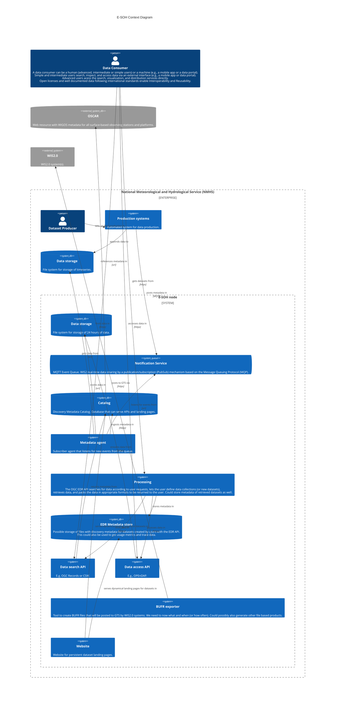

# Technical Architecture Document for E-SOH

## 1. Introduction

### 1.1. Purpose and Scope

The purpose of this Technical Design Document (TDD) is to provide a comprehensive and detailed description of the software system being developed, to serve as a reference for all stakeholders involved in the project. This document aims to:
* Define the software's architecture, components, and their relationships.
* Communicate the design decisions and rationale behind the chosen solutions.
* Provide clear specifications and guidelines for the development team to ensure consistent implementation of features and functionality.
* Establish a baseline for testing and validation, ensuring that the software meets the requirements and design goals.
* Serve as a reference for future maintenance, support, and enhancement of the software system.

The TDD is intended to be a living document, updated as necessary throughout the software development life cycle to reflect any changes or refinements made to the system design. It is essential for all stakeholders, including project managers, developers, testers, and end-users, to have a clear understanding of the software system's design to ensure effective collaboration and successful project completion.

### 1.2. Definitions, Acronyms, and Abbreviations

| Abbreviation             | Meaning                                                               |
|--------------------------|-----------------------------------------------------------------------|
| API                      | Application Programming Interface                                     |
| AWS                      | Automatic Weather Station                                             |
| EDR                      | [OGC API - Environmental Data Retrieval](https://ogcapi.ogc.org/edr/) |
| E-SOH                    | EUMETNET Supplementary Observation dataHub                            |
| EWC                      | [European Weather Cloud](https://www.europeanweather.cloud)           |
| FEMDI                    | Federated European Meteorological Data Infrastructure                 |

### 1.3. References

* WIS 2.0 MQTT topic architecture: https://github.com/wmo-im/wis2-topic-hierarchy
* WMO Core Metadata profile 2: https://github.com/wmo-im/wcmp2
* WIS 2 Notification Message Encoding; https://github.com/wmo-im/wis2-notification-message
* EU High Value Datasets in Open Data Directive: https://eur-lex.europa.eu/eli/reg_impl/2023/138/oj
* Discovery Metadata vocabulary: https://wiki.esipfed.org/Attribute_Convention_for_Data_Discovery_1-3
* CF standard ontology: https://vocab.nerc.ac.uk/standard_name/
* OGC API - Environmental Data Retrieval Standard v1.0.1 https://docs.ogc.org/is/19-086r5/19-086r5.html

## 2. System Overview
### 2.1. Architecture
#### 2.1.1. Landscape Diagram
#### 2.1.2. Context Diagram

#### 2.1.3. Container Diagram

### 2.2. Components and Interfaces

## 3. Detailed Design
### 3.1. Component Design
### 3.2. Data Models
### 3.3. Algorithms and Flows

## 4. Integration and APIs
### 4.1. External Integrations
### 4.2. API Specifications
### 4.3. API Authentication and Authorization
### 4.4. API Rate Limiting and Throttling

## 5.Security and Privacy
### 5.1. Data Protection and Encryption
### 5.2. Authentication and Authorization
### 5.3. Auditing and Logging
### 5.4. Secure Coding Practices
### 5.5. Vulnerability and Threat Mitigation

## 6. Performance and Scalability
### 6.1. Performance Requirements
### 6.2. Performance Testing and Profiling
### 6.3. Caching Strategies
### 6.4. Load Balancing and Failover
### 6.5. Vertical and Horizontal Scaling

## 7. Deployment and Operations
### 7.1. Deployment Environments
### 7.2. Deployment Process
### 7.3. Monitoring and Alerting
### 7.4. Backup and Recovery
### 7.5. Disaster Recovery and Business Continuity

## 8. Maintenance and Support
### 8.1. Code Management and Versioning
### 8.2. Bug Tracking and Issue Resolution
### 8.3. Feature Enhancements and Roadmap
### 8.4. Documentation and Training
### 8.5. Support Channels and SLAs

## 9. Conclusion
### 9.1. Key Takeaways
### 9.2. Future Considerations
### 9.3. Final Remarks
